# reinforcement-learning-skiing

## Description
Developed DQN and DDQN algorithms for OpenAI Gym Skiing environment. Showcased commitment to refining network architecture and preprocessing, addressing challenges in hyperparameter tuning. This project marked my initial venture into reinforcement learning implementations.

The goal of the project was to implement and compare two algorithms for the Atari game Skiing: DQN and DDQN. The project
was implemented in Python 3.11.5.

You can run it by following the instructions described below, and see the documentation [here](#documentation).

## How to run the project

### 1. Install Required libraries

```bash
conda create -n rl-skiing python=3.11.5
conda activate rl-skiing
pip3 install numpy plotly==5.18.0 opencv-python gymnasium
pip3 install "gymnasium[accept-rom-license, atari]"
```

- For windows (GPU):

```bash
pip3 install torch --index-url https://download.pytorch.org/whl/cu121
```

- For windows (CPU) / macos (CPU) / linux (GPU):

```bash
pip3 install torch
```

- For linux (CPU):

```bash
pip install torch torchvision --index-url https://download.pytorch.org/whl/cpu
```

### 2. Set the PYTHONPATH

- Windows - Powershell:

```bash
$env:PYTHONPATH='.' 
```

- Windows - CMD:

```bash
set PYTHONPATH=.
```

- Linux / MacOS:

```bash
export PYTHONPATH=.
```

### 3. Run the project

- Run DQN or DDQN:

```bash
python src/main.py [--dqn | --ddqn]
```

- Test DQN or DDQN:

```bash
python src/test.py [--dqn | --ddqn]
```

## Documentation

### Environment

For the environment we used the OpenAI Gym Skiing game. The environment is shown in depth at
this [link](https://gymnasium.farama.org/environments/atari/skiing/#skiing), but we will explain it here too.

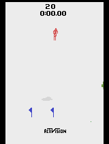

#### Observations

We use the ALE/Skiing-v5 version. The observations consist of frames, which are returned in the following shape: Box(0,
255, (210, 160, 3), uint8), where 3 represents the channels for “RGB”, 210 and 160 being the height and the width,
respectively.

#### Actions

The skier has 3 possible actions, 0 (NOOP / DOWN), 1 (RIGHT) and 2 (LEFT).

#### Rewards

The rewards are alternating between -6 and -7 during the run, and in the final state, when we pass the red flags, we get
a big negative reward depending on the number of flags that we went through and the time it took to finish the run. (Ex.
-8500)

#### Details

- If the skier hits any obstacle, tree or flag, the run does end, nor does it get any negative rewards at that moment,
  but the time lost will impact the total reward at the end of the run.
- We use the environment variant with a frameskip of 4. This will help us a lot for the training speed. The rewards are
  scaled correctly by the game for the frameskip, therefore the baselines we will present apply on our environment even
  though some of them may be tested on an environment with no frame skipping.
- While researching for improvements in our implementation, we’ve found out, after reading
  the [Agent57 Paper](https://arxiv.org/pdf/2003.13350.pdf), that our environment is one of the hardest to train on in
  the Atari suite. By its nature, with the big negative reward at the end of the game, it is a challenging game for the
  agent to learn.

### Baselines

All the baselines found come from this [link](https://paperswithcode.com/sota/atari-games-on-atari-2600-skiing). Some of
the better agents presented in these baselines use additional data, human player data, and are run for very long periods
of time on really powerful computers. Taking all of these in consideration our aim is to beat the baseline for random
actions.
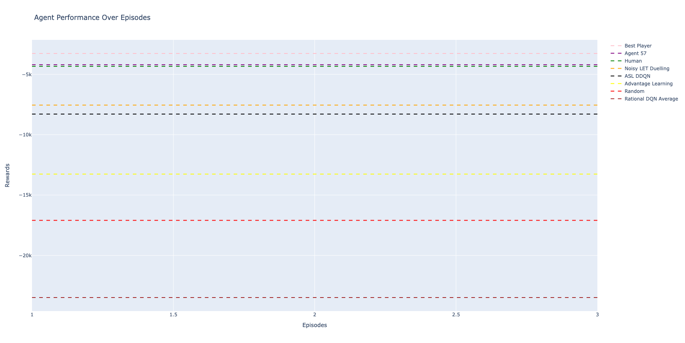

### DQN && DDQN

- Given the context of the skiing game used by us, the complexity and high-dimensional state spaces, it would have been
  suitable to use deep reinforcement learning techniques. Therefore, we thought about implementing two Q-Learning
  algorithms: DQN and DDQN. One advantage of these implementations is that they are suitable for games where the state
  of the environment can change rapidly. In Q-Learning, the policy is updated differently, making it an off-policy
  algorithm, as the Q-learning model continues to learn from experiences, it gradually refines its policy, making better
  decisions over time based on accumulated knowledge.
- The expected reward an agent could receive by choosing an action in a particular state is determined using the Q-value
  function. In deep reinforcement learning, neural networks are used to approximate the Q-value function, with the
  network taking the state as input and outputting Q-values for all possible actions.

#### Performance Comparison

Since both of these algorithms heavily rely on training experience, there were no major differences in performance,
because our hardware resources were limited. Despite this, we saw a noticeable difference in stability while training.

DQN: 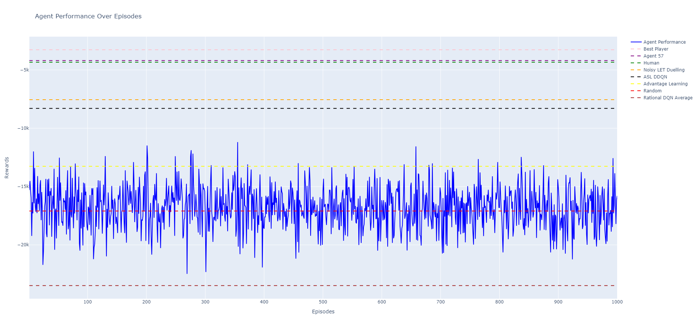
DDQN: 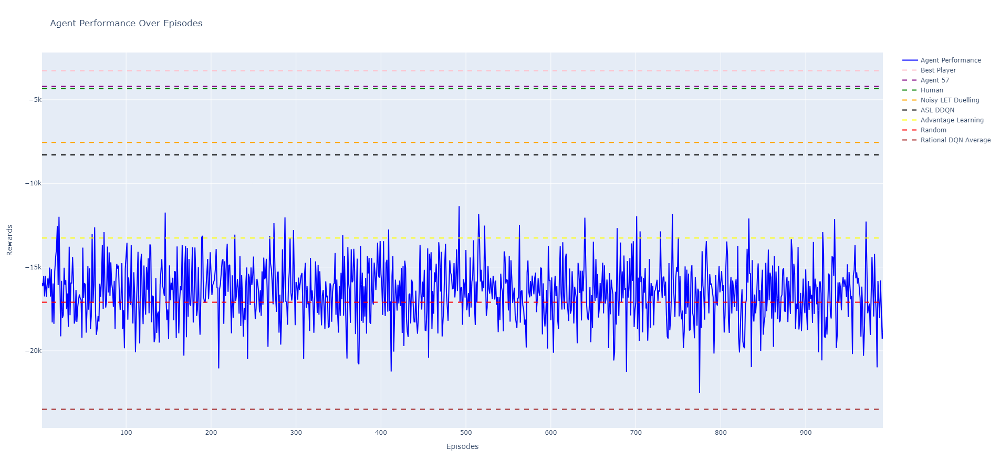

### Preprocessing

- Due to the limited hardware resources, the first step was converting the image to grayscale. In comparison, we ran 100
  episodes using RGB and the results looked similar, but the training time was much higher.
- We wanted to focus on the most relevant visual features observed and the optimal portion for learning was in the
  center of the image. We decided to crop out irrelevant portions, such as the top timestamp and the footer “Activision”
  to improve the efficiency of the reinforcement learning model.
- As our final preprocessing steps we resize the image to 80x80, and normalize it by dividing each pixel with 255. In
  different papers that are tested on Atari games, we saw that the main approach is to resize the games to 84x84. We
  chose not to, because when we visually tested the different resize, the 80x80 is the smallest possible size to prevent
  loss of information, therefore this approach improves the performance a little bit.
  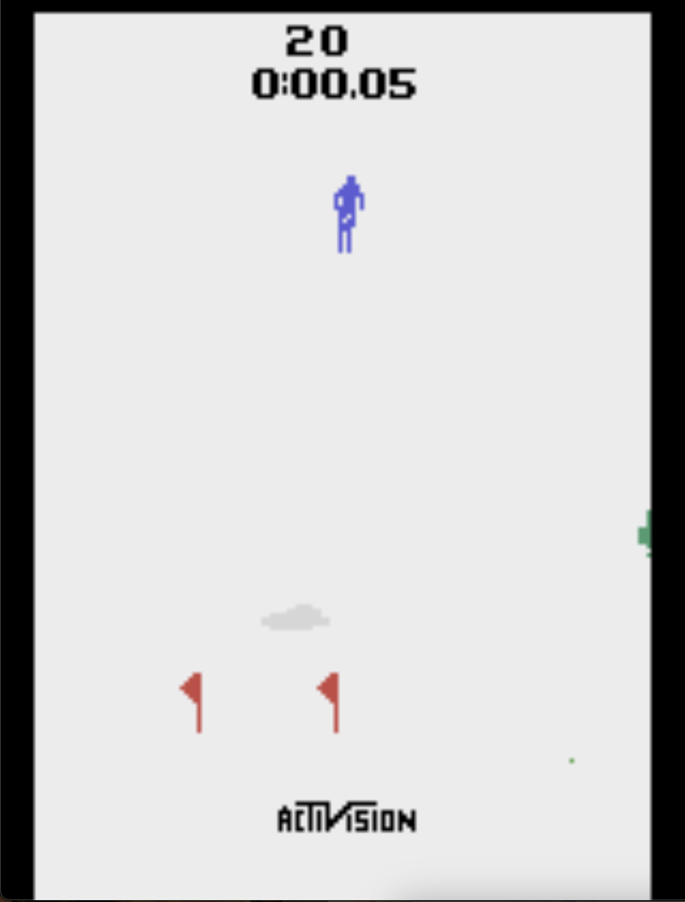
  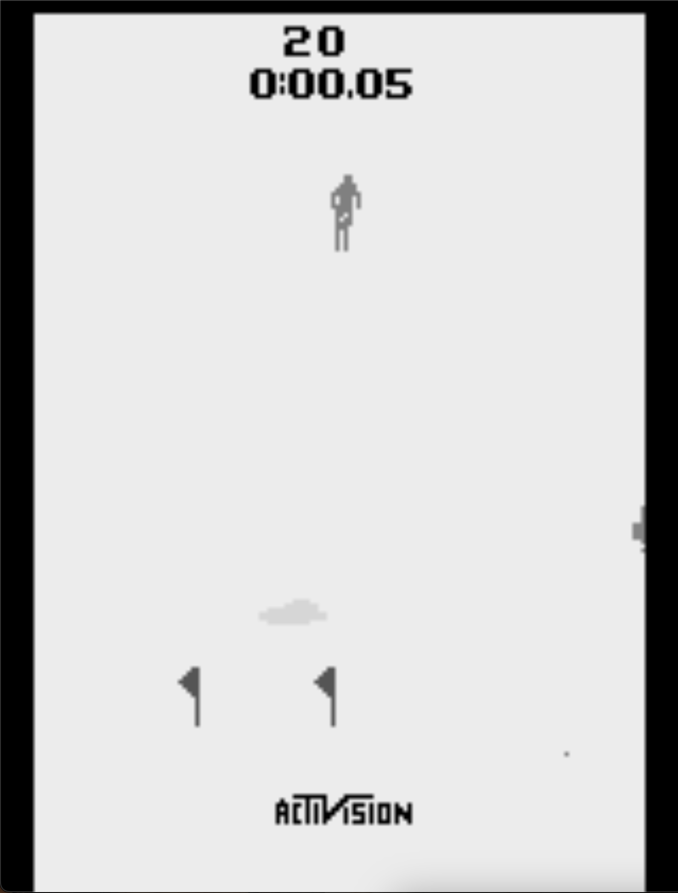
  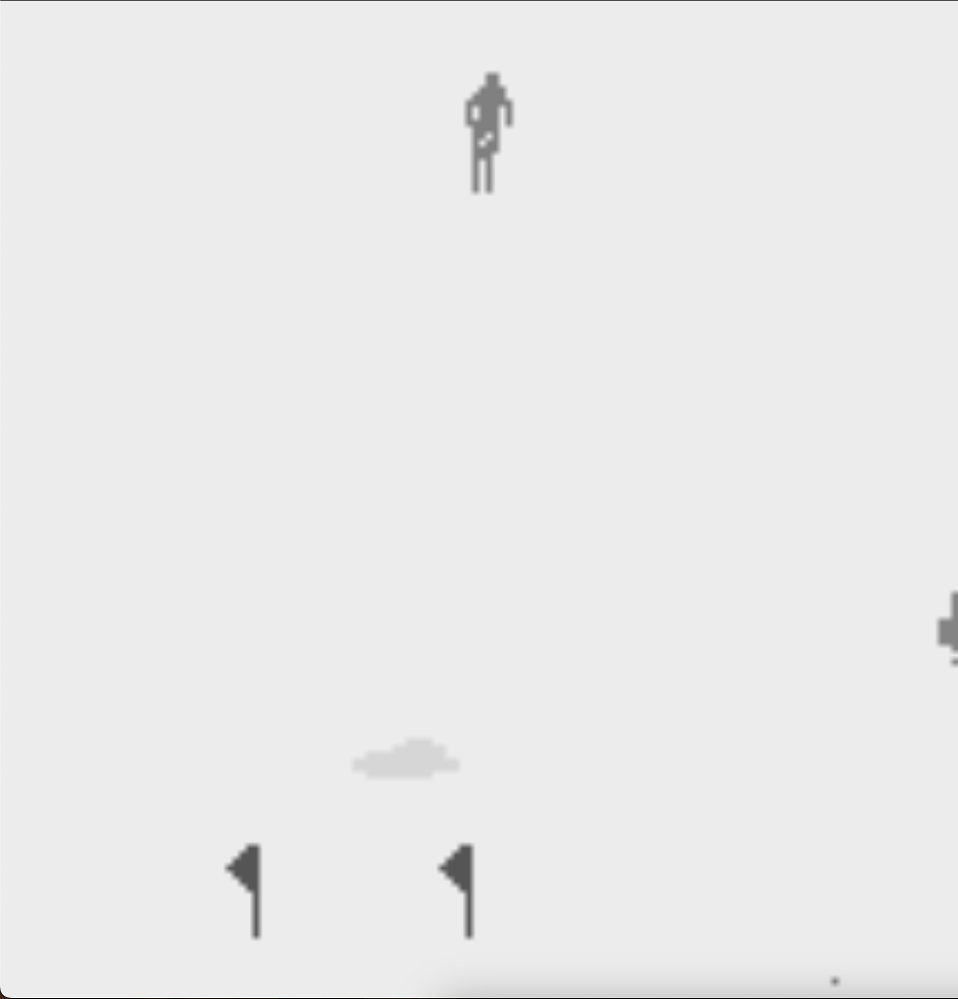
  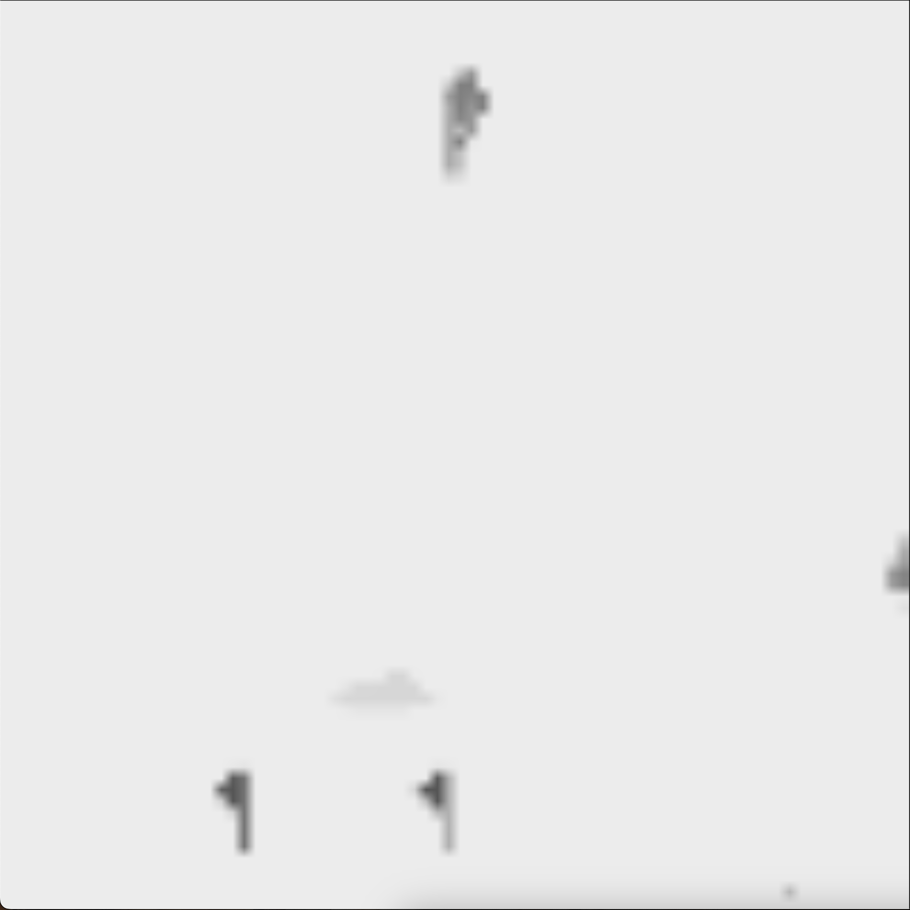

### Incremental steps

We first started with the DDQN algorithm, because there was more work to do. In order to implement the DQN algorithm we
just stopped using the target network.

#### Initial algorithm

- Our first iteration was a really simple one, we wanted to make sure that the DDQN algorithm works properly. The
  network was primitive, 2 convolutional layers followed by 2 linear layers, the final layer being of size 3 (the number
  of possible actions).
- In this step there was no big training, we’ve just made sure that our algorithm is implemented accordingly.
- At this time, our loss function was MSELoss, and the optimizer used was Adam.

#### Optimizing the network

- As it is the main actor in our implementation, the network had to be able to extract information from the
  observations. We tried various variants. In the end, we used the architecture showcased in
  the [Deepmind Paper](https://storage.googleapis.com/deepmind-media/dqn/DQNNaturePaper.pdf). We chose this extensively
  tested and robust architecture, because, after we got stuck in our improvements, we wanted to make sure that the
  network is not the problem.
- For our loss function, we’ve only tried MSELoss and HuberLoss, our final choice being the latter, as it seems that the
  training was more stable, even though the performance of the agent was not improved.
- For our optimizer we tried Adam and RMSProp. The results were similar, but not having time and hardware resources to
  tune the hyperparameters for both of them, we chose to stick with the first one.

#### Using stacked frames

- At this moment we already had some results, around the random baselines situated at around -17000.
- There was one main problem that we did not see in our implementation. We could not catch the velocity of our skier by
  using only one frame at a time, and therefore we opted for stacked frames of 4.
- This implementation remained unchanged for a few days until we realized another major flaw in our algorithm. At the
  start of another episode, we took the last 3 frames from our replay memory and stacked them with our current frame,
  but that was completely wrong, because they are not related. We solved this by hardcoding 3 steps at the beginning of
  each episode to take the action 0 (DOWN). This is a good approach, because our skier needs high speed to achieve a
  good score and also it solves our problem.

#### Optimization - Biggest challenge

- By far the biggest challenge was optimizing our implementation, from hyperparameter tuning, to data visualization and
  analyzation. We tried so many variants that some of them were lost 🙂.
- Some hyperparameters remained unchanged, as they seemed suitable for our context. For example, the epsilon value,
  which represents the exploration rate value. We set it to 1 at the beginning of training, and decreased it by a factor
  until it reached the minimum of 0.1. Gamma (the discount factor) was set to 0.99 and remained there, because it looked
  obvious that in our environment the actions taken are not that important at the moment, but very important in the long
  term.

##### Replay Memory

In theory, the increase of memory dimension results in a better performance. This especially applies to our game, where
the actions are not important at the moment they are taken, but at the end. In our case, once again, the hardware
limitations force us to reduce the memory size. Firstly, we are limited to 16GB of RAM memory, which already fills at
500_000 memory size, and it requests additional space from the solid state drive, which is not performant, thus reducing
the training speed. The second limitation we faced was the number of episodes trained. The lengthiest training sessions
that we did were 5000 episodes, which took around 24 hours depending on the batch size and the network used. When we
start the training process, we fill the memory replay with an initial data of length 50_000. With this memory size of
500_000, we can store 500 episodes at a time in the memory (~1000 steps per episode * 500 episodes). We believe that
this value is good, considering our limitations, because when we run 5000 episodes, there will not be any redundant data
in the memory replay after the first half of the training process.

##### Loss function

As previously stated, we tried MSELoss and HuberLoss. For HuberLoss we tried to optimize the delta, but the default
value was the best option.

##### Optimizer

For optimizers both Adam and RMSProp did a similar job, but we stuck to Adam, since we did not have time to do a
potential grid search due to computational resources.

##### Update frequency

In literature, the best value to update the target network with the weights from the policy network is between 5000 and
10000 learns. Since we have around 1000 steps per episode, and therefore 1000 learns per episode, we tried updating the
network at each 5, 7 and 10 episodes. We chose to stick with the second value mentioned, 7, since it provided the most
stability.

##### Epsilon decay

When thinking about exploitation vs exploration, we used a decaying epsilon value. We start at the value 1 (100% chance
of exploration), and decay it by a factor of 0.9975 (epsilon * 0.9975) per episode, going to a minimum of 0.1. Here we
tried different values, but the previous ones described performed the best. We tried different decaying values: 0.90,
0.95, 0.9975, 0.99 and different minimums, 0.3, 0.1, 0.01. Using the selected values, our epsilon reaches the minimum of
0.1 after 920 episodes, and the agent sees almost 1 million frames before doing mostly exploitation.

##### Batch size

We tried various batch sizes: 16, 32, 64, 256. The best values were 32, 64, and 256. We chose the value 32, since the
training time was somewhat directly proportional to the batch size chosen.

##### Decaying learning rate

Seeing that the average loss was reaching a plateau pretty soon, around 50 episodes, we implemented a decaying learning
rate, starting from 0.1 and 0.01, down to 0.00025. The decaying took place if there were more than 10 episodes that
didn’t improve the current minimum average loss. The idea worked, the loss was decreasing constantly, but there was a
catch. Doing a relatively short training session of 5k episodes, our agent does not have time to find the optimal
policy, therefore we start learning bad policy networks, and enforce them with this decaying learning rate. As a result,
we decided to abandon this idea.

##### Rewards

We tried three different rewards optimizations :clipping between -1 and 0, normalization between -1 and 0, and changing
the sign to +. None of these methods proved useful.

##### Final results

The next plot is the result of our best training session which took 2000 episodes and around 12 hours to finish. The
model is far from being good at the game, but we can see that the plot is indicating a really slow but steady
improvement, in its final 500 episodes hitting higher peaks more often. This model gets a median of -14895.0 reward
tested on 100 episodes.
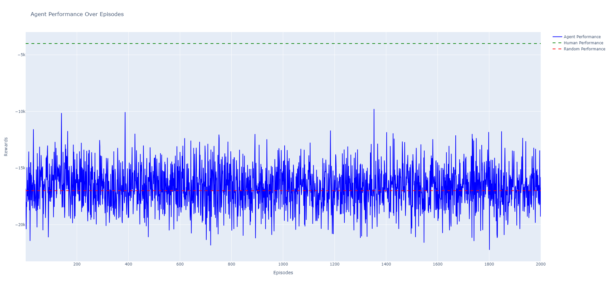

Here are other runs that we did while trying to tune the hyperparameters:
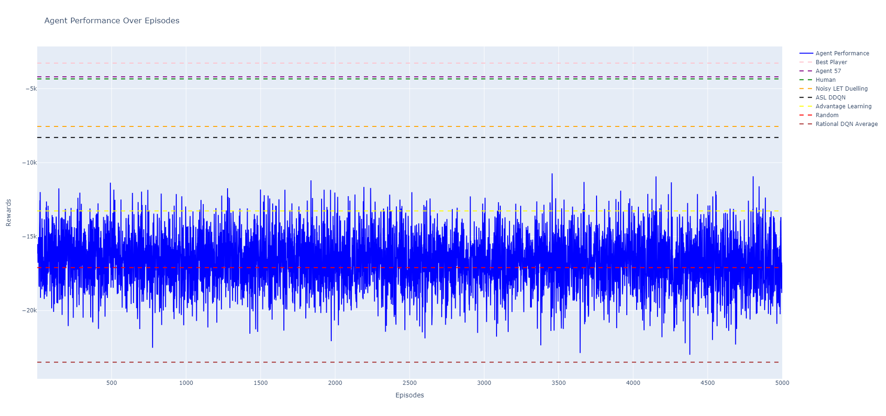
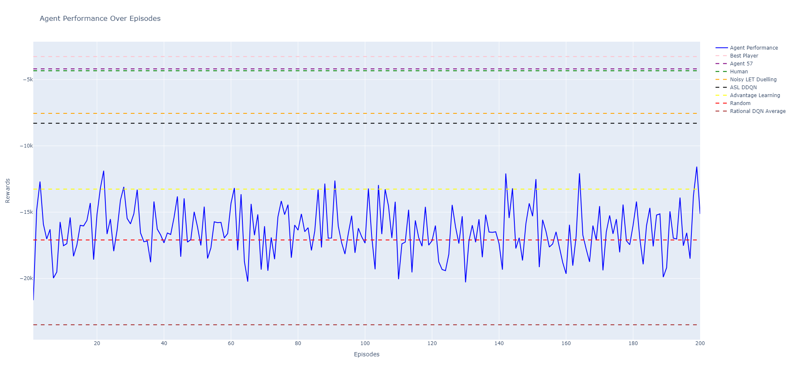

### Agent is trolling us?

In our runs, we observed a really good score, almost too good to be true. After finishing the training, we tested our
agent. It was constantly receiving the same score, a really good one of -9013.

```txt
Episode 1 finished with a reward of -9013.0!
Episode 2 finished with a reward of -9013.0!
Episode 3 finished with a reward of -9013.0!
…
The same for 100 episodes!
```

But when we tested it visually, we observed that our agent found a little trick. If it goes right down (only choosing
the action 0), it will end the episode pretty fast, since there is a small chance of colliding with the flags or trees,
and a pretty good chance of getting through some of the flags.
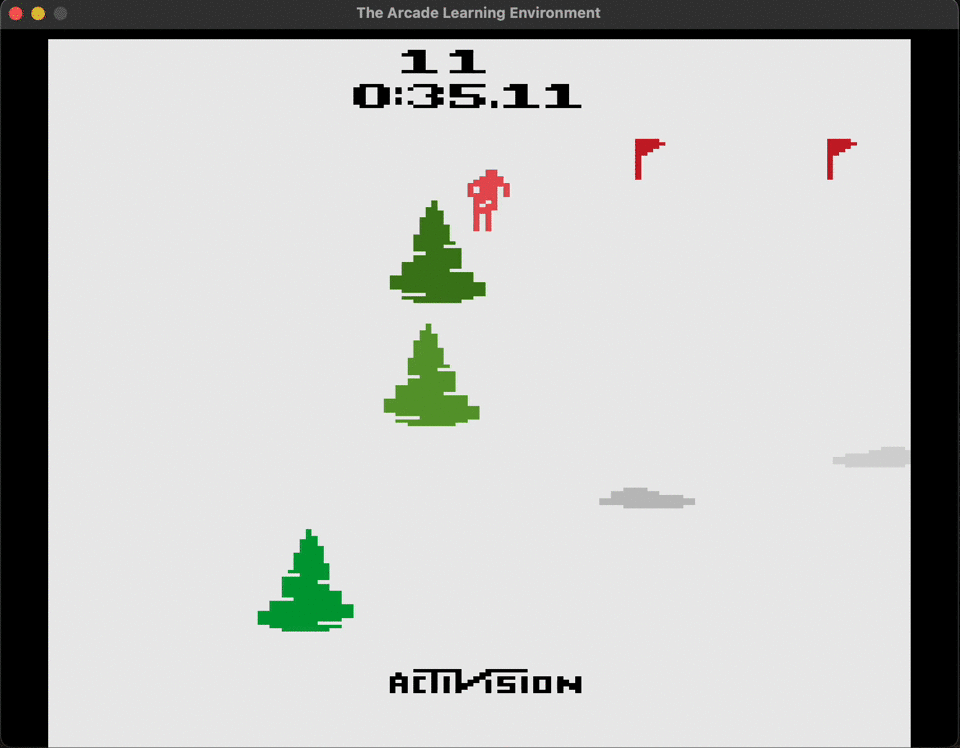

### Future work / ➡️➡️ Next steps

#### Reward shaping

We can try to shape the rewards in other ways. Some of the ideas that come to mind are to detect when we are between
flags using computer vision techniques, and give a positive reward for those frames. We can also enforce the agent to
always have velocity, taxing by giving a big negative reward for staying in place. This happens left and right are
chosen multiple times. We can also force the agent to pick action 0 (DOWN) once every x frames, by giving it a reward,
but this must be done carefully in order to not troll us again as it did before choosing only that action.

#### Grid search

We can try doing a grid search on hyperparameters to find the best possible values for our game.

#### Run, Run and Run

Try larger memory sizes, try more episodes.

### Conclusions - Random vs DDQN Agent

#### Random Agent


#### DDQN Agent


From this video and more runs observed, it seems that our agent only learnt that it needs good speed in order to get
good scores, it does not seem to care too much about the flags or trees. For a bigger improvement of our agent we can
continue by creating custom rewards for hitting the trees, getting stuck in one place or hitting the walls.

While it may not be obvious at a first glance, our agent did a little bit of learning. Our hardware limitations may or
may not have been our biggest problem, forcing us to take small learning and optimization steps. Nevertheless, the game
we chose is a difficult one, we did not achieve a really smart agent, but we believe that this was the beauty of the
project. Its complexity led us to write, test, experiment, read, research and try all sorts of new techniques.

